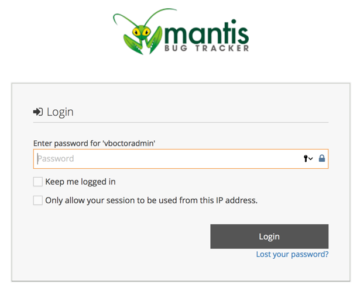
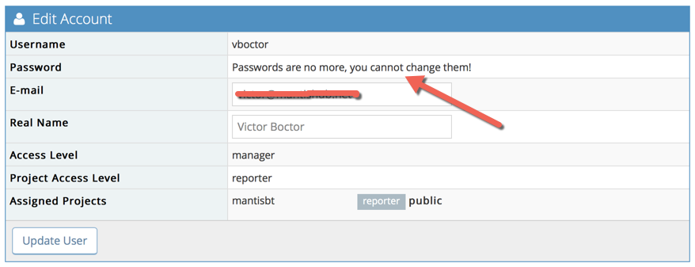

# SampleAuth Plugin

#
# Autoprov and authenticator support added by Tamas Dajka (viper@vipernet.hu)
#

This is a sample authentication plugin showing how a MantisBT authentication plugin can implement its own authentication and control authentication related flags on a per user basis.

The authentication mechanism implemented by this plugin works as follows:
- If user is administrator, use standard authentication.
- If user is not registered in the db, user standard behavior.
- Otherwise, auto-signin the user without a password.

Users that are auto-signed in, can't manage or use passwords that are stored in the MantisBT database.

The plugin can be easily modified to redirect to an identity provider and validate the token returned or validate a username and password against a database or LDAP.

## Config parameters
- `autoprovision` set to 'true', if the plugin can do autoprovisioning - otherwise only "known" users will be able to log in
- `default_access_level` sets the access level configured by autoprov; defaults to system configures default access level

## Authentication Flags
The authentication flags events enables the plugin to control MantisBT core authentication behavior on a per user basis.
Plugins can also show their own pages to accept credentials from the user.

- `password_managed_elsewhere_message` message to show in MantisBT UI to indicate that password is managed externally.  If left blank or not set, the default message will be used.
- `can_use_standard_login` true then standard password form and validation is used, false: otherwise.
- `login_page` Custom login page to use. Will be called, if Mantis fails to authenticate the user against it's own mechanisms
- `credential_page` The page to show to ask the user for their credential.
- `authenticator_page` The page to validate the username AND password
- `logout_page` Custom logout page to use.
- `logout_redirect_page` Page to redirect to after user is logged out.
- `session_lifetime` Default session lifetime in seconds or 0 for browser session.
- `perm_session_enabled` Flag indicating whether remember me functionality is enabled (ON/OFF).
- `perm_session_lifetime` Lifetime of session when user selected the remember me option.
- `reauthentication_enabled` A flag indicating whether reauthentication is enabled (ON/OFF).
- `reauthentication_expiry` The timeout to require re-authentication.  This is only applicable if `reauthentication_enabled` is set to ON.

If a flag is not returned by the plugin, the default value will be used based on MantisBT core configuration.

The plugin will get a user id and username within an associative array.  The flags returned are
in context of such user.  If user is not in db, then user_id will be 0, but username will be what
the user typed in the first login page that asks for username.

If plugin doesn't want to handle a specific user, it should return null.  Otherwise, it should
return the `AuthFlags` with the overriden settings.

## Options/Setup possibilities

If you want to use multiple auth backends, than you'll have to do filtering. You'll have two possibilities to do so:
- use authenticator_page and setup the login there
- setup filtering in class and have multiple instances of the class (not yet tested)

1) Set login_page
- if you set the login page, than the user will be validated after Mantis runs login.php. It's difficult to properly set up, due to Mantis logic
- only works, if the user is known to Mantis. Autoprovisioning is not possible.

2) Set credential_page
- you'll be able to use SSO or orher 3rd party auth provider
- this is called, once Mantis asks for the username
- you'll have to ask for the user's password
- will only work, if the user is known to Mantis OR you set up and turn on autoprovisioning!

3) Set authenticator_page
- you'll make use of Mantis built in login mech (username/password page)
- you'll have to use your own method to authenticate the user, with the possibility of autoprovision it (and assign to projects, etc)

## Screenshots

Native Login Page for Username

Native Credentials Page for Password (skipped for non-administrators)

User My Account Page

## Dependencies
MantisBT v2.14.0-dev once authenticator and autoprovision support is added.
